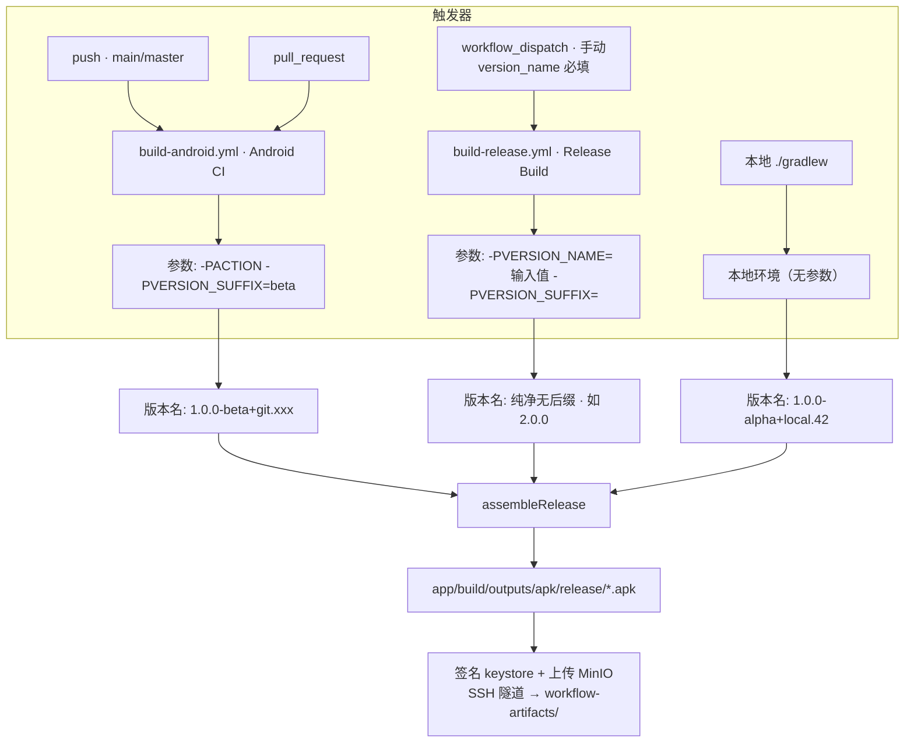

# Github CI

本目录包含两个职责分离的 GitHub Actions workflow，以及本地开发构建：

| 构建来源 | Workflow 文件 | 显示名称 | 触发方式 | 用途 | 版本名示例 |
|---------|--------------|---------|---------|------|-----------|
| GitHub Actions | `build-android.yml` | Android CI | `push` / `pull_request` | 自动构建 beta 测试包 | `1.0.0-beta+git.abc1234` |
| GitHub Actions | `build-release.yml` | Release Build | `workflow_dispatch`（手动） | 手动构建纯净 release 包 | `2.0.0` |
| 本地开发 | — | — | `./gradlew assembleRelease` | 本地构建 | `1.0.0-alpha+local.42` |

## Secrets 配置

需要在 GitHub Repository Settings → Secrets and variables → Actions 中配置以下 secrets：

| Secret 名称 | 说明 |
|-------------|------|
| `KEYSTORE_FILE_BASE64` | 签名密钥库文件的 Base64 编码 |
| `KEYSTORE_PASSWORD` | 密钥库密码 |
| `KEY_ALIAS` | 密钥别名 |
| `KEY_PASSWORD` | 密钥密码 |
| `SSH_PRIVATE_KEY` | SSH 私钥（用于建立隧道） |
| `SSH_HOST` | SSH 远程主机地址 |
| `SSH_USER` | SSH 用户名 |
| `MINIO_ACCESS_KEY` | MinIO 访问密钥 |
| `MINIO_SECRET_KEY` | MinIO 密钥 |

## 工作流程说明

两个 workflow 的构建步骤基本一致（检出代码 → JDK 17 → 解码密钥库 → 开源许可证 → 构建 Release APK → 上传 MinIO），区别仅在于**触发方式**与**构建参数**。

### 1. Android CI — `build-android.yml`（push/PR 自动 beta 构建）

**触发条件：**

1. **push** - 推送到 `main` 或 `master` 分支时触发
2. **pull_request** - 创建或更新 PR 时触发

**构建参数：** `-PACTION -PVERSION_SUFFIX=beta` → 版本 `1.0.0-beta+git.xxx`

### 2. Release Build — `build-release.yml`（手动 release 构建）

**触发条件：**

1. **workflow_dispatch** - Actions 页面手动触发，**必须**填写输入：
   - `version_name` (必填): 版本名，如 `2.0.0`

**构建参数：** `-PVERSION_NAME={version_name} -PVERSION_SUFFIX=`（空）→ 纯净无后缀版本 `2.0.0`

### 共同构建步骤

1. **检出代码** - 获取完整 git 历史（用于计算 versionCode 和获取 commit hash）
2. **设置 JDK 17** - 使用 Eclipse Temurin 发行版
3. **解码密钥库** - 将 Base64 编码的密钥库解码为文件
4. **生成开源许可证** - 运行 `licenseReleaseReport` 任务
5. **构建 Release APK** - 参数因 workflow 而异（见上两节）
6. **安装 MinIO 客户端** - 下载并安装 `mc` 工具
7. **建立 SSH 隧道** - 连接到远程主机并转发 MinIO 端口（9000）
8. **配置 MinIO** - 设置 MinIO 别名
9. **上传 APK** - 将构建好的 APK 上传到 MinIO 存储桶

### 版本命名规则

根据构建来源与触发方式，版本名会自动添加不同后缀：

| 构建来源 | 触发方式 | 版本名示例 | 说明 |
|---------|---------|-----------|------|
| GitHub Actions | `build-android.yml`：push/PR 到 main/master | `1.0.0-beta+git.abc1234` | beta 后缀 + git commit hash |
| GitHub Actions | `build-release.yml`：workflow_dispatch (手动) | `2.0.0` | 纯净版本，使用输入的 version_name |
| 本地开发 | `./gradlew assembleRelease` | `1.0.0-alpha+local.42` | alpha 后缀 + commit 计数 |
| 本地开发 (自定义) | `./gradlew assembleRelease -PVERSION_NAME=2.0.0` | `2.0.0-alpha+local.42` | 自定义版本名 + alpha 后缀 |

对应 `app/build.gradle.kts` 中的判断逻辑：

- `build-android.yml`（push/PR）→ 传 `-PACTION -PVERSION_SUFFIX=beta`，对应 `isAction=true` 分支
- `build-release.yml`（workflow_dispatch）→ 传 `-PVERSION_NAME={version_name} -PVERSION_SUFFIX=`（空），对应 `isDispatch=true` 分支（纯净无后缀）
- 本地开发 → 无参数，对应 alpha 分支

versionCode 基于 git commit 数量自动生成。